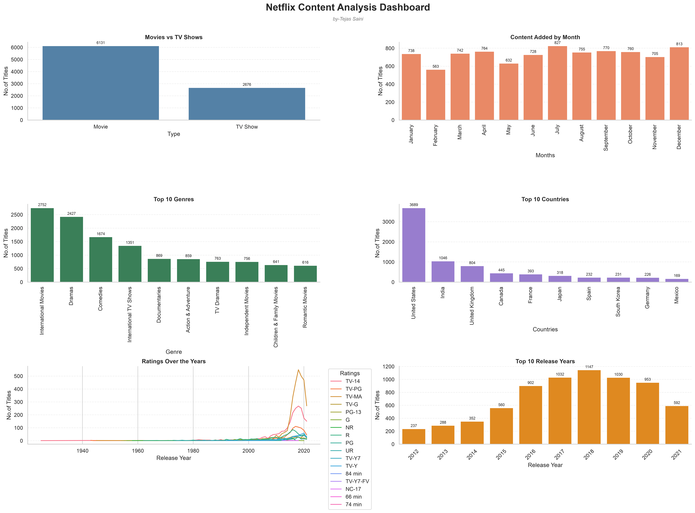

# 🎬 Netflix Content Analysis Dashboard

## 📌 Project Overview

This project performs an Exploratory Data Analysis (EDA) on the Netflix Titles dataset using Python. The objective is to analyze Netflix's content library, identify trends, and visualize key business insights through an interactive dashboard.

---

## 📂 Dataset

- **Dataset:** Netflix Titles Dataset
- **Source:** https://www.kaggle.com/datasets/shivamb/netflix-shows

---

## 🛠️ Technologies Used

- Python
- Pandas
- NumPy
- Matplotlib
- Seaborn
- Jupyter Notebook

---

## 📊 Dashboard



---

## 📈 Dashboard Highlights

The dashboard summarizes:

- Movies vs TV Shows
- Content Added by Month
- Top 10 Genres
- Top 10 Countries
- Content Ratings over the Years
- Top 10 Release Years

---

## 💡 Key Business Insights

### 🎬 Content Type
- Movies constitute the majority of Netflix's catalog.
- TV Shows represent a smaller but steadily growing portion.

### 🌍 Countries
- The United States contributes the highest number of titles.
- India and the United Kingdom are also among the major contributors.

### 🎭 Genres
- International Movies and Dramas dominate the catalog.
- Netflix focuses heavily on globally appealing content.

### 📅 Content Addition
- Certain months experience noticeably higher content additions, indicating seasonal release strategies.

### 🔞 Ratings
- Mature audience ratings (such as TV-MA) have become increasingly common over the years.

---

## 📁 Project Structure

```
Netflix-EDA-Dashboard
│
├── netflix.ipynb
├── Netflix_Dashboard.png
├── netflix_titles.csv
└── README.md
```

---

## 🚀 Author

**Tejas**